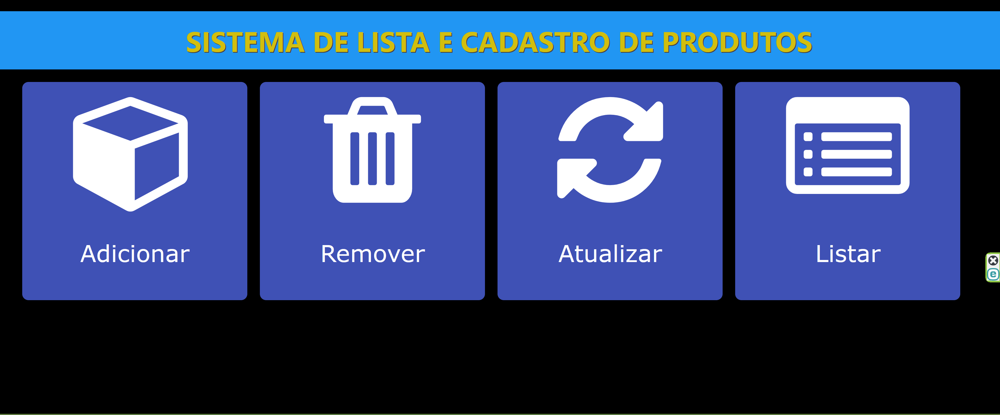
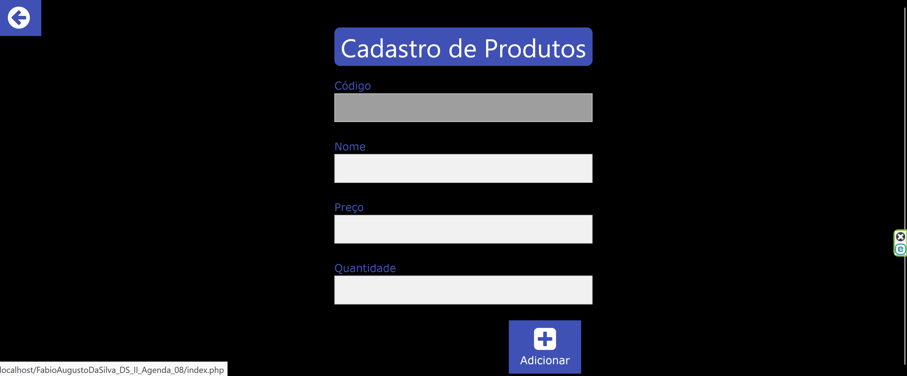
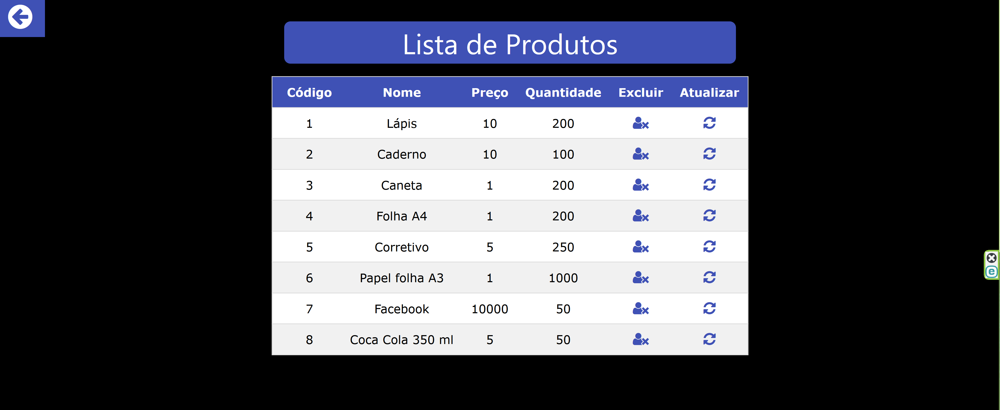

# Sistema De Cadastro De Produtos!

Desenvolvi um sistema de cadastro de produtos simples, que permite a inclusão, exclusão e atualização dos mesmos. Essa aplicação foi criada utilizando PHP e possui integração com um banco de dados MySQL. Com esse sistema, você pode gerenciar seus produtos de forma fácil e eficiente, garantindo um controle adequado das informações.

## Objetivo

O objetivo desse sistema de cadastro de produtos é fornecer uma solução simples e eficiente para gerenciar informações de produtos, permitindo a inclusão, exclusão e atualização de forma prática. Com essa aplicação em PHP e banco de dados MySQL, você terá maior controle sobre seus produtos, facilitando o processo de gerenciamento e garantindo uma organização eficaz das informações. Simplifique sua rotina de cadastro de produtos com esse sistema intuitivo e funcional.

## Diferencial

Um diferencial desse sistema de cadastro de produtos é a sua simplicidade e facilidade de uso. Com uma interface intuitiva, ele permite que você gerencie seus produtos de forma rápida e eficiente, realizando inclusões, exclusões e atualizações com apenas alguns cliques. Além disso, a integração com o banco de dados MySQL garante uma armazenagem segura e confiável das informações. Desfrute desse diferencial e simplifique o processo de cadastro e controle de produtos em seu negócio.

## Tecnologias

* PHP
* HTML5
* CSS3
* Javascript
* Bootstrap
* MySQL
  
## Status

Concluído

## Telas

  
  
  
  
  

**Proibida a distribuição ou revenda desse material.**
